# Girraj Barua — Portfolio

Personal portfolio website showcasing my skills, projects, experience, education, certificates, and professional profiles.

**Live Website:** https://girraj-studio.netlify.app/
**Source Code:** https://github.com/girrajbarua7880/girraj-studio

## Overview

A modern, responsive portfolio website built with React. The website presents my technical skills, development projects, professional experience, education, certificates, digital badges, and contact information in a single-page interface.

## Tech Stack

* React
* Vite
* JavaScript
* Tailwind CSS
* Framer Motion
* Lucide React
* React Icons

## Features

* Responsive design
* Single-page portfolio
* Smooth section navigation
* Animated UI elements
* Mobile navigation
* Project showcase
* Skills and tools sections
* Experience and education timeline
* Certificates and digital badges
* Resume access
* GitHub and social profile links
* Email and WhatsApp contact
* Reusable React components
* Data-driven portfolio sections

## Screenshots

### Hero

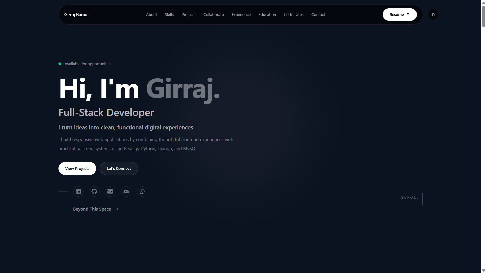

### About

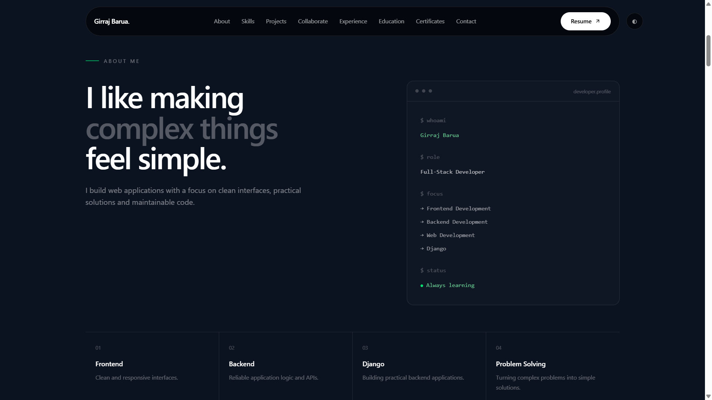

### Skills

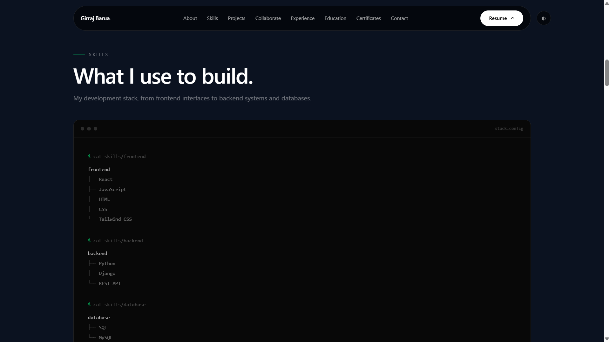

### Tools

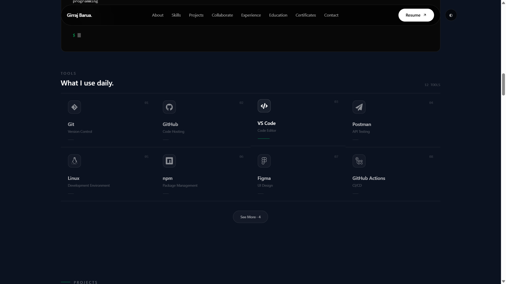

### Projects

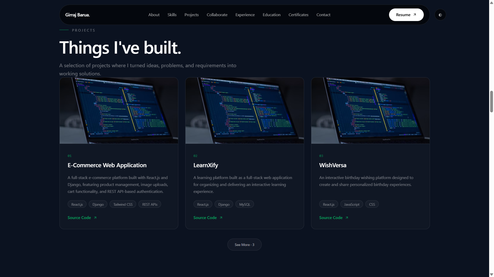

### Collaboration

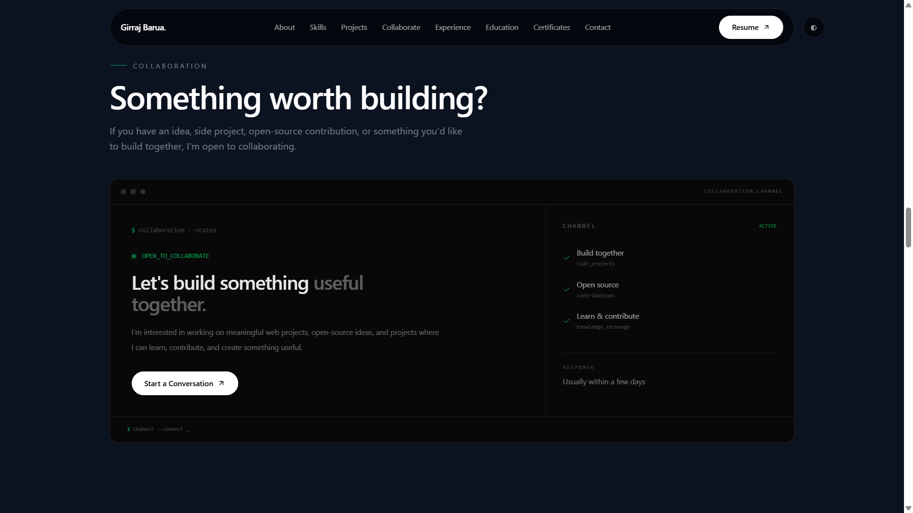

### Experience

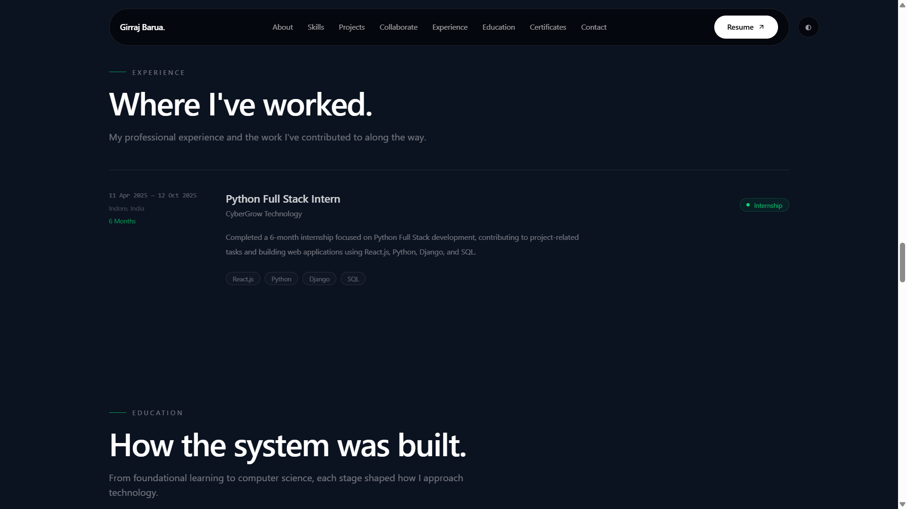

### Education

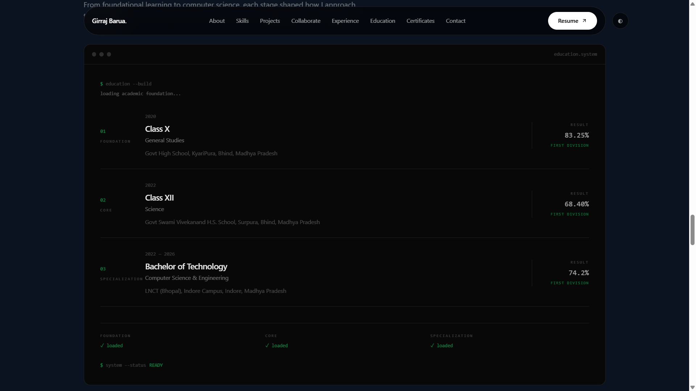

### Certificates

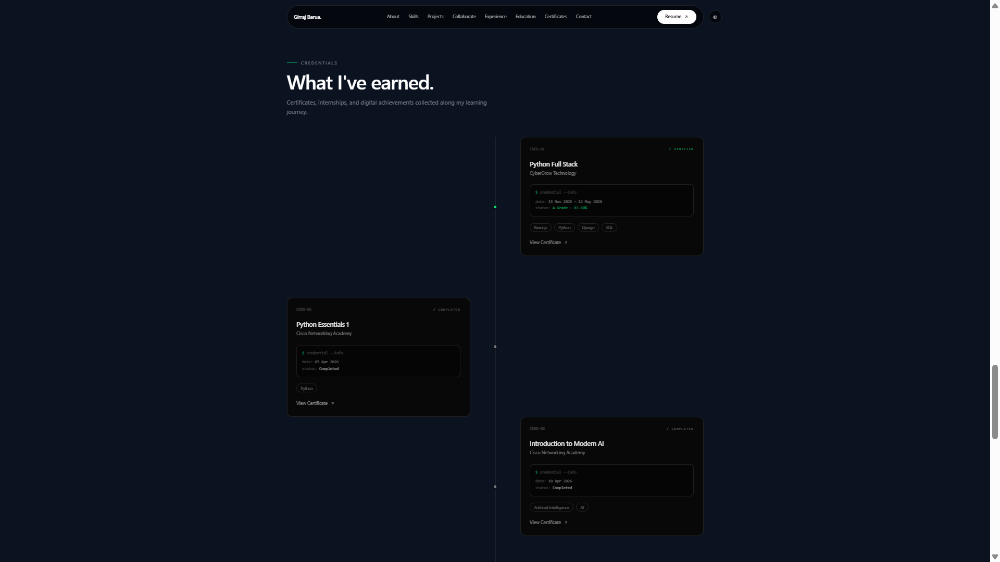

### Digital Badges

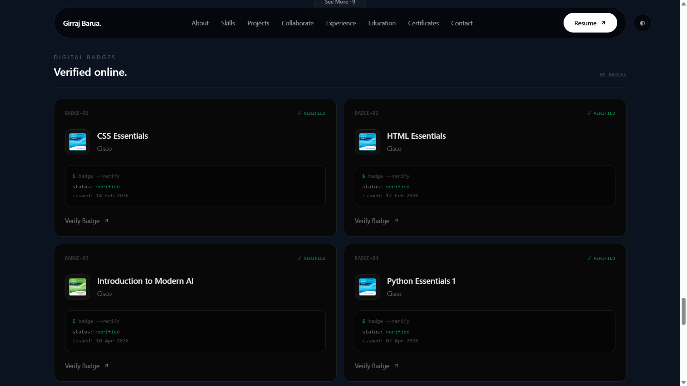

### Contact

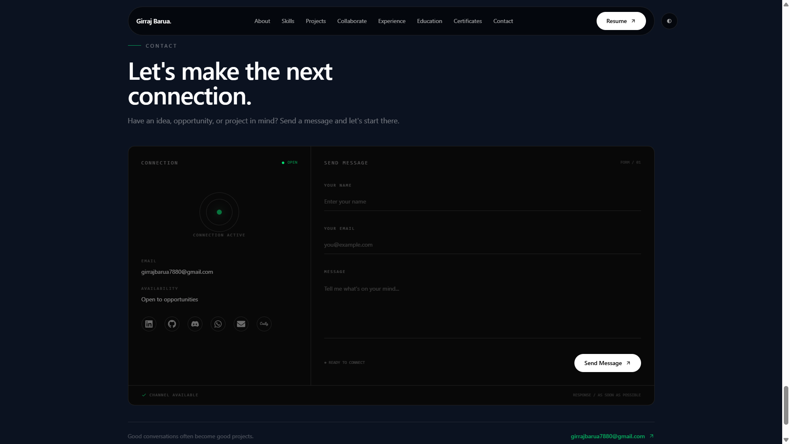

## Skills

### Frontend

* React
* JavaScript
* HTML
* CSS
* Tailwind CSS

### Backend

* Python
* Django
* REST API

### Database

* SQL
* MySQL

### Programming

* Python
* JavaScript

## Tools

* Git
* GitHub
* VS Code
* Postman
* Linux
* npm
* Figma
* GitHub Actions
* Vercel
* Netlify
* Render
* Cloudinary

## Projects

### E-Commerce Web Application

Full-stack e-commerce application built with React.js and Django, including product management, image uploads, cart functionality, and REST API-based authentication.

**Technologies:** React.js, Django, Tailwind CSS, REST APIs

### LearnXify

Full-stack learning platform focused on providing an organized and interactive learning experience.

**Technologies:** React.js, Django, MySQL

### WishVersa

Interactive birthday wishing platform for creating and sharing personalized birthday experiences.

**Technologies:** React.js, JavaScript, CSS

### React Projects

Collection of React projects focused on frontend development, component design, and JavaScript functionality.

**Technologies:** React.js, JavaScript

### Weather App

Weather application built using React and Vite.

**Technologies:** React.js, Vite, JavaScript

### Calculator

Calculator application built using Django and Python.

**Technologies:** Python, Django

## Experience

### Python Full Stack Intern — CyberGrow Technology

**11 Apr 2025 — 12 Oct 2025**
Indore, India · 6 Months

Worked on Python Full Stack development and project-based web application tasks using:

* React.js
* Python
* Django
* SQL

## Education

### Bachelor of Technology — Computer Science & Engineering

**LNCT (Bhopal), Indore Campus**
2022 — 2026 · 74.2%

### Class XII — Science

**Govt Swami Vivekanand H.S. School, Surpura, Bhind, Madhya Pradesh**
2022 · 68.40%

### Class X — General Studies

**Govt High School, KyariPura, Bhind, Madhya Pradesh**
2020 · 83.25%

## Certificates & Digital Badges

The portfolio includes certificates and digital badges covering:

* Python Full Stack
* Python
* HTML
* CSS
* Artificial Intelligence
* Cybersecurity
* Ethical Hacking
* Penetration Testing
* Network Fundamentals
* Defensive Security
* Offensive Security

## Contact

The portfolio provides access to professional and social profiles, including:

* LinkedIn
* GitHub
* Email
* WhatsApp
* Discord
* Reddit
* Instagram
* Telegram
* Credly

## Project Structure

```text
girraj-studio/
├── README.md
├── docs/
│   ├── hero.png
│   ├── about.png
│   ├── skills.png
│   ├── tools.png
│   ├── projects.png
│   ├── collebration.png
│   ├── experince.png
│   ├── education.png
│   ├── certificates.png
│   ├── badges.png
│   └── contact.png
│
├── public/
│   ├── certificates/
│   └── ...
│
├── src/
│   ├── components/
│   │   ├── animation/
│   │   ├── cards/
│   │   ├── common/
│   │   └── layout/
│   │
│   ├── data/
│   │   ├── certificatesData.js
│   │   ├── educationData.js
│   │   ├── experienceData.js
│   │   ├── personalData.js
│   │   ├── projectsData.js
│   │   └── skillsData.js
│   │
│   ├── sections/
│   │   ├── About/
│   │   ├── Certificates/
│   │   ├── Collaboration/
│   │   ├── Contact/
│   │   ├── Education/
│   │   ├── Experience/
│   │   ├── Hero/
│   │   ├── Projects/
│   │   └── Skills/
│   │
│   ├── App.jsx
│   ├── index.css
│   └── main.jsx
│
├── index.html
├── package.json
└── ...
```

## Development

Install dependencies:

```bash
npm install
```

Start the development server:

```bash
npm run dev
```

Create a production build:

```bash
npm run build
```

Run linting:

```bash
npm run lint
```

Preview the production build:

```bash
npm run preview
```

## Deployment

The portfolio is deployed on Netlify.

**Live Website:** https://girraj-studio.netlify.app/
**Source Code:** https://github.com/girrajbarua7880/girraj-studio
